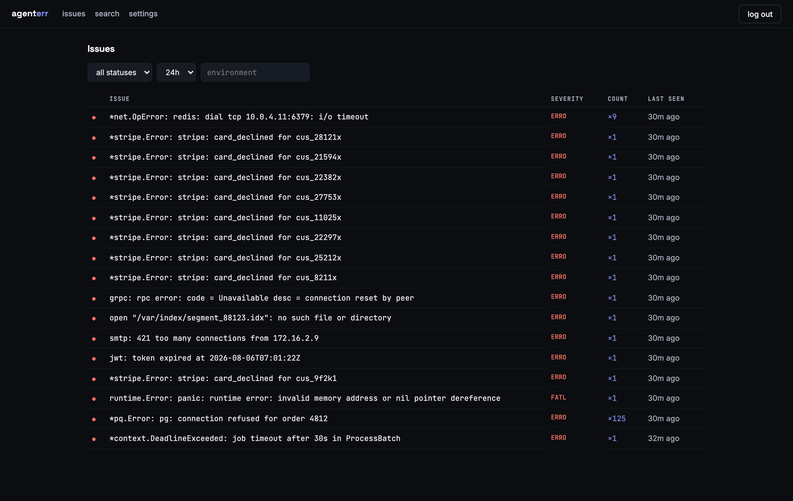

[](https://github.com/agenterr/agenterr/actions/workflows/ci.yml)
[](go.mod)
[](LICENSE)

# Agenterr

Agenterr is a self-hosted error and log tracker in one Go binary: OTLP and
JSON log ingest, error grouping, full-text search, a REST API, an MCP
server, and a minimal web UI, backed by SQLite — no queues, no Postgres, no
separate services to run. It's built for agents first: eight MCP tools and
a shipped Claude Code skill are the primary interface, and the web UI
exists for verification and light management.


<sub>Replayed session — the tool outputs are captured verbatim from a live
instance. Rendered from [`docs/demo/demo.tape`](docs/demo/demo.tape).</sub>

## Quickstart

Run it with Docker, mounting a volume for the database:

```
docker run -p 3617:3617 -v agenterr-data:/data ghcr.io/agenterr/agenterr:latest
```

Or grab a binary from the [releases page](https://github.com/agenterr/agenterr/releases)
and run it directly:

```
./agenterr --listen :3617 --db ./agenterr.db
```

Either way, the first run prints a block like this once, to stdout:

```
=== Agenterr: first run ===
Generated admin password: 8f2a1c9d4e6b0173
Admin API key:            agt_admin_9c1e...
Setup URL:                http://localhost:3617/
Save these now: the key is shown only once and cannot be recovered.
============================
```

The password logs you into the web UI at the setup URL. The admin key
authenticates everything else below — it is instance-wide and satisfies any
key check, so keep it out of client code; mint narrower `api`/`ingest` keys
per project instead. Neither is recoverable if lost: mint a fresh admin key
by hand against the database, or delete `agenterr.db` and let the process
re-bootstrap.

Create a project and mint keys for it:

```
curl -X POST http://localhost:3617/api/v1/projects \
  -H "Authorization: Bearer agt_admin_9c1e..." \
  -H "Content-Type: application/json" \
  -d '{"name":"checkout-api","retention_days":30}'
# {"id":1,"name":"checkout-api","slug":"checkout-api","retention_days":30}

curl -X POST http://localhost:3617/api/v1/projects/1/keys \
  -H "Authorization: Bearer agt_admin_9c1e..." \
  -H "Content-Type: application/json" \
  -d '{"kind":"ingest"}'
# {"key":"agt_ingest_..."}
```

Point something at it. A raw JSON batch:

```
curl -X POST http://localhost:3617/api/v1/ingest \
  -H "Authorization: Bearer agt_ingest_..." \
  -H "Content-Type: application/json" \
  -d '[{"severity":"error","service":"checkout-api","environment":"production","body":"panic: nil pointer"}]'
```

Or an OTLP/HTTP log exporter (gzip-encoded bodies are also accepted):

```
OTEL_EXPORTER_OTLP_LOGS_ENDPOINT=http://localhost:3617/v1/logs
OTEL_EXPORTER_OTLP_LOGS_HEADERS=Authorization=Bearer%20agt_ingest_...
```

Or point an OpenTelemetry Collector's `otlphttp` exporter at the same
endpoint:

```yaml
# otel-collector-config.yaml
exporters:
  otlphttp/agenterr:
    logs_endpoint: http://localhost:3617/v1/logs
    headers:
      Authorization: "Bearer agt_ingest_..."

service:
  pipelines:
    logs:
      receivers: [otlp]
      exporters: [otlphttp/agenterr]
```

## Agent setup

Give an agent access to the eight MCP tools (`list_projects`, `list_issues`,
`get_issue`, `search_logs`, `get_log_context`, `resolve_issue`,
`ignore_issue`, `get_stats`) either directly over Streamable HTTP:

```
claude mcp add --transport http agenterr https://logs.example.com/mcp \
  --header "Authorization: Bearer agt_api_..."
```

or through the `agenterr-mcp` stdio proxy, if the agent only speaks stdio:

```
claude mcp add agenterr -- agenterr-mcp --url https://logs.example.com --key agt_api_...
```

Then install the shipped workflow skill from this repo's `skills/`
directory — `skills/agenterr-debugging/SKILL.md` — which walks an agent
through orientation, finding the top issue, pulling log context, fixing the
code, and resolving the issue once the fix has shipped.

## The web UI

For when you want to look yourself: issues, search, and settings, behind a
single admin login.



## Configuration

| Env var | Flag | Default | Meaning |
|---|---|---|---|
| `AGENTERR_LISTEN` | `--listen` | `:3617` | HTTP listen address |
| `AGENTERR_DB` | `--db` | `./agenterr.db` | SQLite database path |
| `AGENTERR_ADMIN_PASSWORD` | `--admin-password` | (generated) | Admin web UI password; set to skip first-run generation |
| `AGENTERR_BUFFER_SIZE` | `--buffer-size` | `10000` | Pipeline in-memory buffer capacity, in logs |
| `AGENTERR_FLUSH_EVERY_MS` | `--flush-every` | `200` | Pipeline batch-write interval |
| `AGENTERR_MAX_BODY_BYTES` | `--max-body-bytes` | `5242880` (5MB) | Max request body any ingest edge accepts |
| `AGENTERR_MAX_DB_BYTES` | `--max-db-bytes` | `0` (unlimited) | Guardrail: if the DB file exceeds this, prune the oldest day across every project |

Flags override env vars, which override the defaults above.

## Self-hosting notes

- **Backup is one file.** Everything lives in the SQLite database at
  `AGENTERR_DB` (WAL mode, so also copy the `-wal`/`-shm` files if you're
  doing a raw filesystem copy while the process is running). For continuous
  off-site backup with minimal downtime risk, run it under
  [Litestream](https://litestream.io/).
- **Retention** is set per project (`retention_days` at creation) and
  enforced by an hourly sweep; `AGENTERR_MAX_DB_BYTES` is a coarse
  last-resort guardrail on top of that, not a replacement for it.
- **`/healthz`** is unauthenticated and pings the store on every call —
  point your uptime checker or orchestrator's readiness probe at it.

## License

AGPL-3.0 — self-hosting is free and unlimited, forever.
